<p align="center">
  
</p>

<h1 align="center">TaskMon</h1>

<p align="center">
화면 하단을 달리는 픽셀 아트 펫이 시스템 상태를 실시간으로 모니터링하고 알림을 표시하는 데스크톱 펫 애플리케이션입니다.<br/>
Tauri · React 19 · TypeScript · Rust 기반으로 만들어졌습니다.
</p>

<p align="center">
  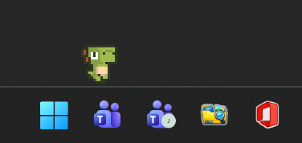
</p>

## 주요 기능

- 화면 하단/모니터 테두리를 따라 자유롭게 이동하는 픽셀 아트 펫 (멀티 모니터 지원)
- 23종의 펫 캐릭터 선택 (해골, 좀비, 공룡, 몬스터, 사람, 고양이 등)
- CPU 사용률 비례 이동 속도 (0% → 1배, 100% → 5배)
- **6가지 이동 모드**: 기본 이동(오른쪽/왼쪽/반복), 등반 이동(오른쪽/왼쪽), 아무 곳으로 이동(랜덤)
- 시스템 모니터링: CPU, 메모리, 네트워크 속도, 배터리 잔량
- 배터리 충전 중 캐릭터 옆에 충전 아이콘(⚡) 표시
- 마우스 호버 시 말풍선으로 시스템 수치 또는 사용자 정의 메시지 표시
- **5종 알림 타입**: 반복(Interval), 특정시간(Absolute), 매일(Daily), 타이머(Relative), 매시(Hourly)
- 1~60분 집중 타이머 (캐릭터 위 MM:SS 카운트다운 표시)
- 펫 색상/크기/속도/높이 개별 커스터마이징 (펫별로 저장)
- 캐릭터 외 빈 영역 클릭 투과 (뒤쪽 바탕화면/앱으로 클릭 통과)
- 전체화면 앱 위에서 자동으로 뒤로 숨김
- 다국어 UI: 한국어 / English (시스템 기본 자동 선택 가능)
- 시스템 트레이 상주 (좌클릭/더블클릭: 설정, 우클릭: 메뉴)

## 시스템 요구 사항

- Windows 10 (1809 이상) 또는 Windows 11
- WebView2 런타임 (Windows 11 기본 포함, Windows 10은 자동 설치)

## 설치

### 릴리스에서 설치

1. [Releases](https://github.com/jongcheol-pak/TaskMon/releases) 페이지에서 최신 버전을 내려받습니다.
2. NSIS 설치 파일(`TaskMon_x.x.x_x64-setup.exe`)을 실행하여 현재 사용자 계정에 설치합니다.
3. 시작 메뉴 또는 바탕화면 바로가기로 실행합니다.

### 소스에서 빌드

사전 요구 사항: [Node.js 18+](https://nodejs.org/), [Rust 1.75+](https://rustup.rs/), [Visual Studio Build Tools](https://visualstudio.microsoft.com/visual-cpp-build-tools/)

```bash
git clone https://github.com/jongcheol-pak/TaskMon.git
cd TaskMon
npm install
npm run tauri build
```

빌드 결과물(설치 파일/실행 파일)은 `src-tauri/target/release/bundle/` 아래에 생성됩니다.

개발 모드 실행:

```bash
npm run tauri dev
```

## 사용 방법

1. **앱 실행** — 첫 실행 시 시스템 트레이에 펫 아이콘이 나타나고, 작업표시줄 위로 캐릭터가 등장합니다.
2. **트레이 메뉴** — 트레이 아이콘을 우클릭하여 설정 창 열기, 종료, 일시 중지를 선택합니다. 더블클릭은 설정 창을 엽니다.

   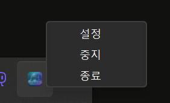

3. **펫 선택 및 커스터마이징** — 좌측 메뉴 `펫`에서 캐릭터를 고르고 크기·속도·높이를 조절합니다. 하단의 `펫 색상 커스텀` 컬러 피커로 펫의 색조를 자유롭게 변경할 수 있습니다 (펫별로 개별 저장).

   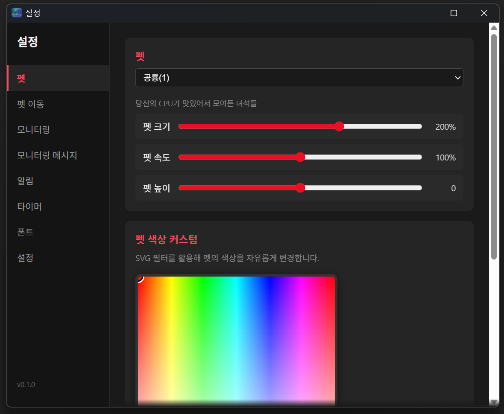

4. **이동 모드 선택** — 좌측 메뉴 `펫 이동`에서 6가지 모드 중 하나를 선택합니다. 등반 모드는 모니터 테두리를 따라 4-Phase(하단 → 측면 등반 → 상단 → 측면 하강)로 순회하며, 멀티 모니터에서는 50% 확률로 다음 모니터로 건너뜁니다.

   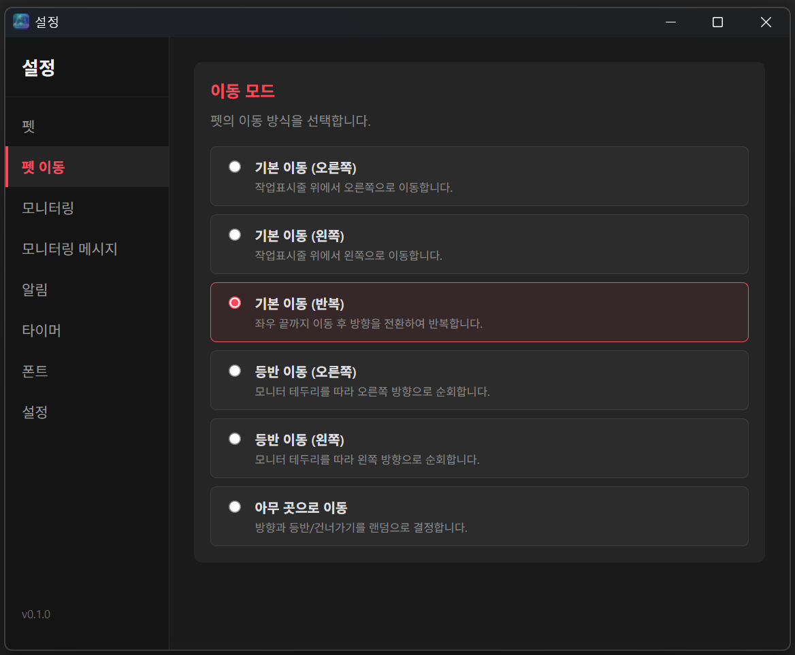

5. **모니터링 항목** — 좌측 메뉴 `모니터링`에서 표시할 시스템 항목을 선택합니다. 폴링 간격(초)과 충전 아이콘 크기/거리도 함께 설정할 수 있습니다 (배터리가 없는 데스크탑에서는 배터리 항목이 자동 비활성화됩니다).

   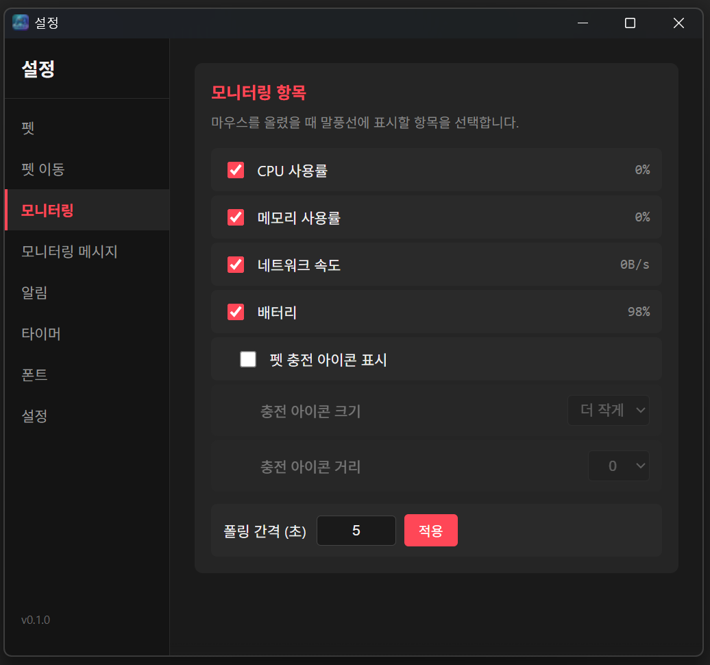

6. **모니터링 메시지** — 좌측 메뉴 `모니터링 메시지`에서 시스템 상태 조건(예: CPU > 80%)에 따라 펫이 표시할 메시지를 추가합니다. 메시지에 이모지를 삽입할 수 있고, 조건에 맞는 모든 메시지를 일정 간격으로 순환 표시할지 우선순위 1개만 표시할지 선택할 수 있습니다.

   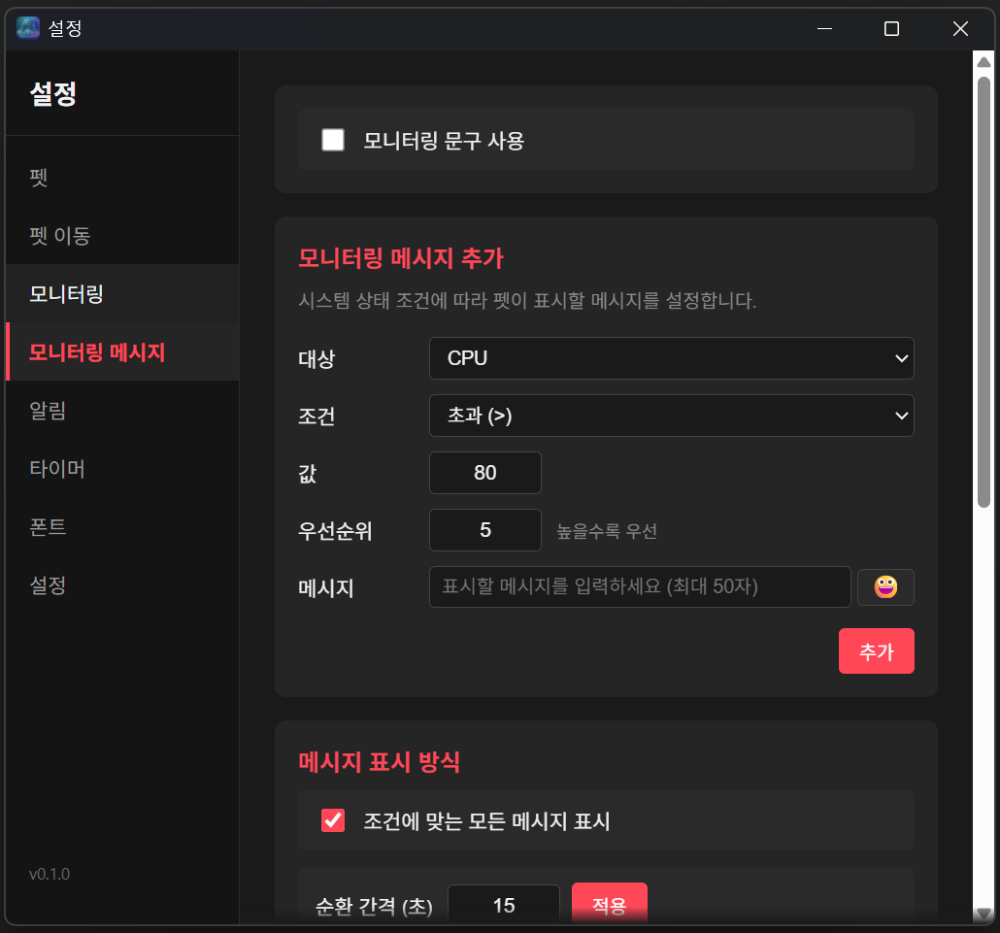

7. **알림 등록** — 좌측 메뉴 `알림`에서 5가지 타입(반복/특정 시간/매일/타이머/매시)의 알림을 등록합니다. 알림 메시지는 모니터링 메시지보다 우선 표시할 수 있고, 중복 알림 처리 방식(모두 표시 / 먼저 표시 / 최근 우선)도 선택할 수 있습니다.

   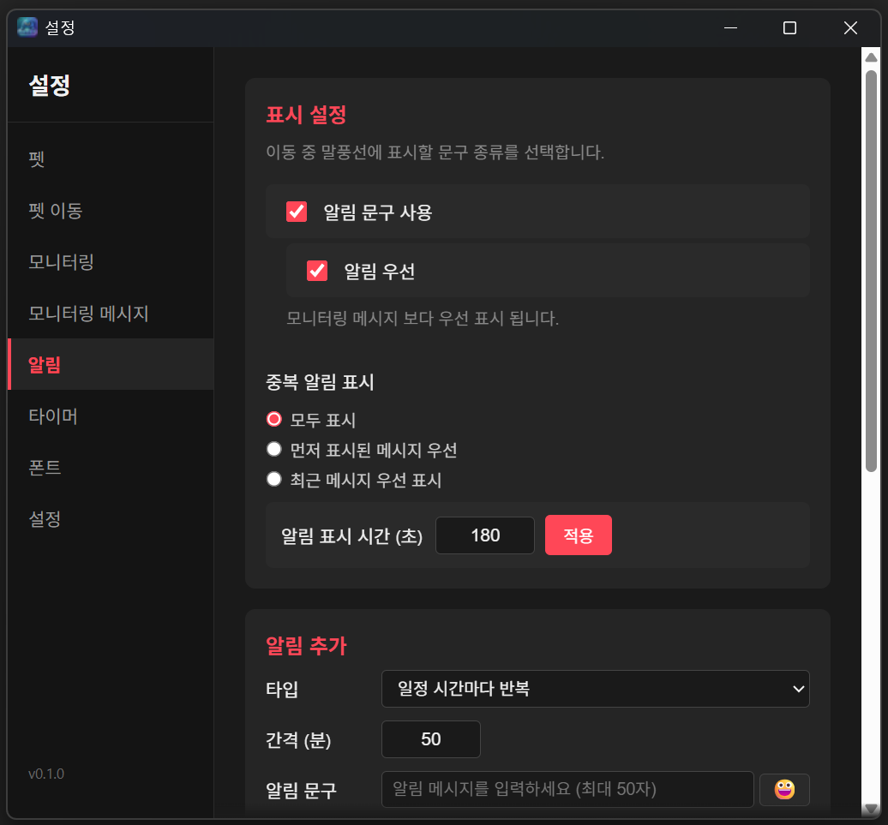

   알림이 발화되면 펫 머리 위에 말풍선으로 메시지가 표시됩니다.

   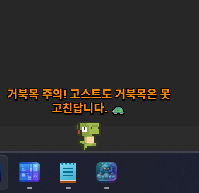

8. **타이머** — 좌측 메뉴 `타이머`에서 1~60분 집중 타이머를 시작합니다. 시작 후에는 캐릭터 위에 MM:SS 카운트다운이 표시되고, 진행 중에는 모든 알림과 모니터링 메시지가 숨겨집니다. 마우스를 펫에 가까이 가져가면 기존 모니터링 수치가 표시됩니다.

   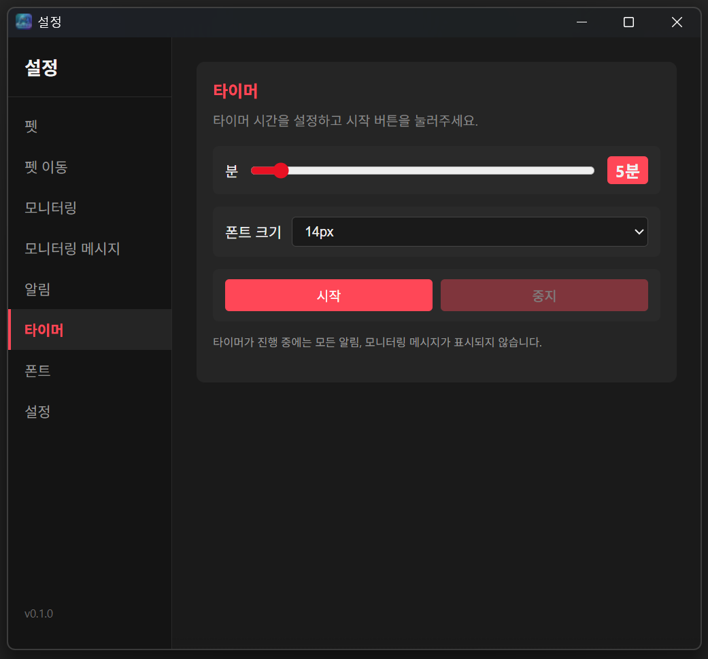

### 폰트 설정

좌측 메뉴 `폰트`에서 말풍선 메시지의 폰트 크기, 폰트 종류, 모니터링/알림 메시지 색상을 각각 변경할 수 있습니다 (20색 팔레트 제공).

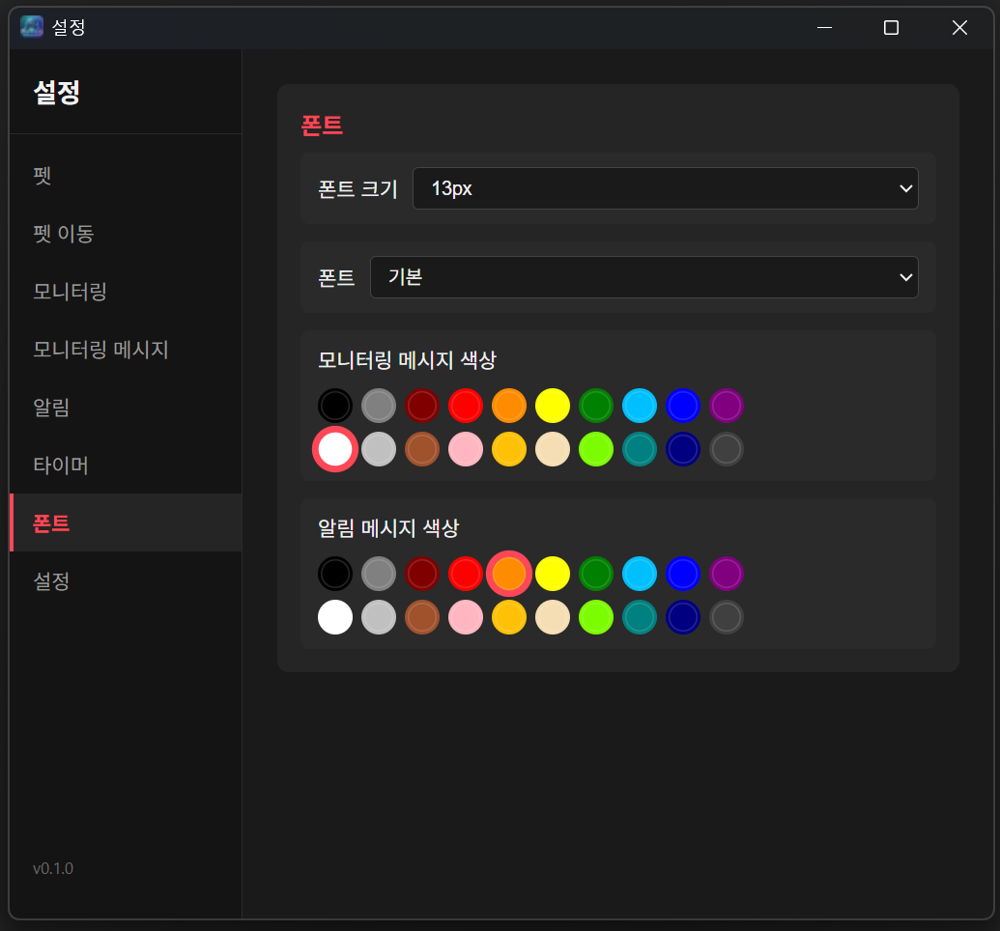

### 일반 설정

좌측 메뉴 `설정`에서 자동 실행, 마우스 인터랙션, 말풍선 표시 옵션, 언어를 변경할 수 있으며 변경 즉시 적용됩니다.

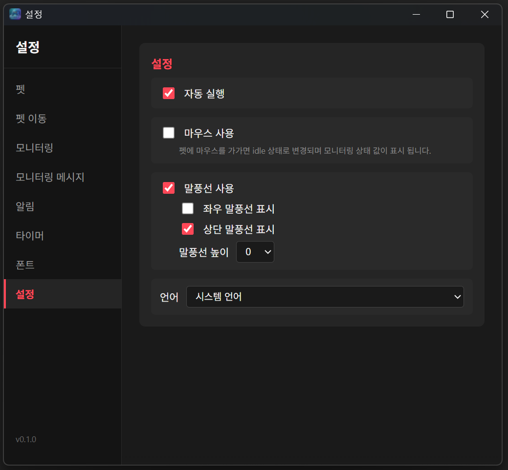

- **자동 실행**: Windows 로그인 시 자동으로 시작 (`HKCU\...\Run\TaskMon` 레지스트리 등록)
- **마우스 사용**: 해제 시 캐릭터가 마우스에 반응하지 않으며 클릭 투과
- **말풍선 사용**: 모니터링/알림 메시지 표시 토글
  - **좌우 말풍선 표시**: 등반/하강 중(Phase 1, 3) 말풍선 표시 여부
  - **상단 말풍선 표시**: 상단 이동 중(Phase 2) 말풍선 표시 여부
  - **말풍선 높이**: 캐릭터 머리 위 말풍선 위치 조정 (0~30)
- **언어**: 시스템 언어 / 한국어 / English

### 정보

좌측 메뉴 `정보`에서 앱 버전, 프로젝트 라이선스, GitHub 저장소 링크, 이미지 에셋 출처(itch.io)와 제작자 표기를 확인할 수 있습니다. 저장소 링크와 itch.io 링크를 클릭하면 기본 브라우저로 열립니다.

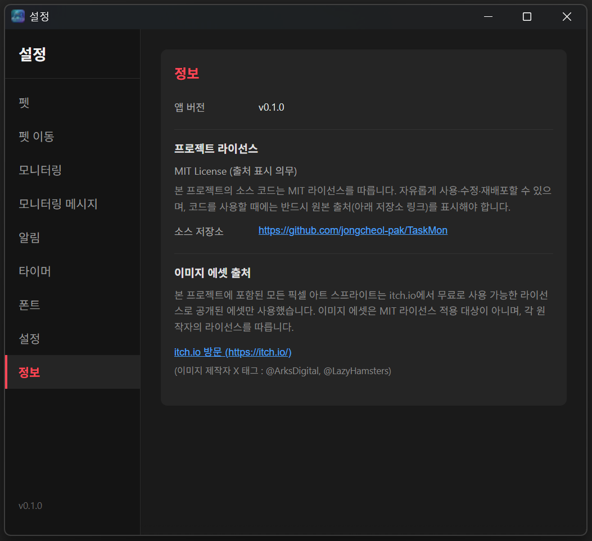

## 설정 저장 위치

| 항목 | 저장 위치 |
|---|---|
| 사용자 설정 (펫/색상/모니터링/알림/메시지 등) | 앱 내부 LocalStorage (`%LocalAppData%\TaskMon\EBWebView\Default\Local Storage\`) |
| 자동 실행 등록 | `HKCU\Software\Microsoft\Windows\CurrentVersion\Run\TaskMon` |

## 주요 의존성

- [Tauri 2](https://tauri.app/) — 데스크톱 앱 프레임워크 (Rust 백엔드 + WebView 프론트엔드)
- [React 19](https://react.dev/) — 프론트엔드 UI
- [sysinfo](https://crates.io/crates/sysinfo) — CPU/메모리/네트워크 모니터링
- [starship-battery](https://crates.io/crates/starship-battery) — 배터리 정보
- [rand](https://crates.io/crates/rand) — 랜덤 이동 결정
- [sys-locale](https://crates.io/crates/sys-locale) — 시스템 언어 감지

## 알려진 제한 사항

- 현재 Windows만 지원합니다 (macOS/Linux 미지원).
- 사용자 설정은 WebView LocalStorage에 저장되므로 앱 재설치/WebView 데이터 삭제 시 초기화됩니다 (알림/메시지 목록은 설정 화면에서 JSON으로 내보내기/가져오기 가능).
- 펫 이미지(픽셀 아트 스프라이트)는 [itch.io](https://itch.io/)에서 무료 사용 가능한 에셋만 사용했으며, 본 프로젝트의 MIT 라이선스가 적용되지 않습니다.

## 라이선스

본 프로젝트의 소스 코드는 **MIT License (출처 표시 의무)** 하에 배포됩니다. 자유롭게 사용·수정·재배포할 수 있으며, 코드를 사용할 때에는 반드시 원본 저장소(`https://github.com/jongcheol-pak/TaskMon`)를 출처로 표시해야 합니다. 자세한 조건은 루트의 [LICENSE](LICENSE) 파일을 참고하세요.

이미지 에셋(`src/assets/`)은 [itch.io](https://itch.io/)에서 무료로 사용 가능한 라이선스로 공개된 픽셀 아트만 사용했습니다. 이미지 에셋은 MIT 라이선스 적용 대상이 아니며, 각 원작자의 라이선스를 따릅니다.

이미지 제작자 X 태그: [@ArksDigital](https://x.com/ArksDigital), [@LazyHamsters](https://x.com/LazyHamsters)

Copyright © 2026 JongCheol Pak ([@jongcheol-pak](https://github.com/jongcheol-pak))
